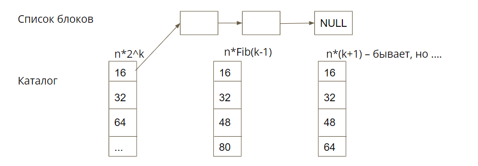

# Основы программирования

- [Основы программирования](#основы-программирования)
  - [Память](#память)
    - [Fixed-size blocks](#fixed-size-blocks)
    - [Binary Buddies](#binary-buddies)
    - [Slab allocation](#slab-allocation)
    - [Схема работы](#схема-работы)
  - [Проектирование интерфейсов](#проектирование-интерфейсов)
    - [Виды элементов управления](#виды-элементов-управления)
    - [Layout](#layout)
    - [Глобализация продукта](#глобализация-продукта)
    - [Сообщения об ошибках](#сообщения-об-ошибках)
    - [Тестирование](#тестирование)
  - [Парадигмы программирования](#парадигмы-программирования)
    - [Imperative](#imperative)
    - [Procedural](#procedural)
    - [Теорема структурного программирования](#теорема-структурного-программирования)
    - [ООП](#ооп)
    - [Функциональная парадигма](#функциональная-парадигма)
    - [Декларативная парадигма](#декларативная-парадигма)
    - [Логическое программирование](#логическое-программирование)
  - [Принципы ООП](#принципы-ооп)
    - [Подходы к определению объекта](#подходы-к-определению-объекта)
    - [Три кита ООП](#три-кита-ооп)
      - [Абстракция](#абстракция)
      - [Инкапсуляция](#инкапсуляция)
      - [Наследование и композиция](#наследование-и-композиция)
    - [Проектирование классов](#проектирование-классов)
    - [Предметно-ориентированное проектирование](#предметно-ориентированное-проектирование)
    - [Принципы SOLID](#принципы-solid)
      - [Закон Деметры](#закон-деметры)
    - [Некоторые общие рекомендации](#некоторые-общие-рекомендации)
  - [JVM Zoo](#jvm-zoo)
    - [JVM](#jvm)
    - [История](#история)
    - [Популярные акронимы](#популярные-акронимы)
    - [JRE](#jre)
    - [Конфигурации и профили](#конфигурации-и-профили)
    - [JavaME](#javame)
    - [JavaSE (J2SE) и JavaEE(J2EE)](#javase-j2se-и-javaeej2ee)
    - [Android $\neq$ Java](#android-neq-java)
    - [Популярные реализации JVM/JRE/JDK](#популярные-реализации-jvmjrejdk)
    - [Языки JVM](#языки-jvm)
    - [Cross-platform UI](#cross-platform-ui)

## Память

### Fixed-size blocks

Делим память на блоки фиксированного размера. Блок выглядит следующим образом:

Идея в следующем: храним массив из указателей на связные списки. В связных списках хранятся указатели на свободные блоки

Операция выделения памяти простая: идем по каталогу и

- если указатель на свободный блок - nullptr, то ищем дальше
- иначе взять первый свободный
- изменить указатель головы списка на следующий блок

Операция освобождения:

- Указатель головы списка нацелить на новый свободный блок
- В блок записать указатель на блок, который был ранее головой

Основная проблема FSB — фрагментация, как внешняя, так и внутренняя. Однако в силу высокой скорости работы FSB часто используется как базовый алгоритм для других аллокаторов.

Самая важная модификация FSB — memory pool. Идея заключается в следующем: выделяем один большой кусок памяти, делим его на кусочки маленького размера и храним список свободных кусочков. Вообще говоря, список хранить необязательно: можно хранить битовую маску, где $i$-й бит равен 0, если $i$-й блок занят, и 1, если свободен

💡 [Веселые возможности битовых операций](http://graphics.stanford.edu/~seander/bithacks.html#ZerosOnRightMultLookup)

### Binary Buddies

В предыдущих алгоритмах внешняя фрагментация возникала из-за того, что мы не могли объединить свободные блоки маленького размера. Данный алгоритм решает эту проблему.

Каждому блок ставится в соответствие *порядок,* размер блока $i$-го порядка пропорционален $2^i$, а также он ровно в два раза больше размера блока на порядок меньше. Когда блок делится пополам, его половинки становятся “buddies” друг другу. Также “buddies” можно слить в один блок бОльшего порядка

Основные идеи:

- разделять наименьший блок до тех пор, пока он вдвое превосходит размер требуемой памяти при выделении.
- если “приятель” освобождаемого блока пуст, то объединять их.

Разбор примера можно найти [тут](https://en.wikipedia.org/wiki/Buddy_memory_allocation).

Однако, binary buddies всё еще страдает от внутренней фрагментации.

### Slab allocation

Основные идеи:

- Некоторые объекты ядра (например, дескрипторы процесса) часто создаются и уничтожаются
- Объекты одного типа имеют одинаковый размер
- Объекты одного типа могут быть объединены в цепочки, в которых места для новых объектов могут быть заранее предопределены.

Кэши объектов

- состоят из указателей на один или несколько кусков, в которых может храниться несколько объектов одного типа
- каждый из кусков может быть полным, частично заполненным или пустым
- **слабы — непрерывные участки памяти, состоящие из смежных страниц**

### Схема работы

Ядро часто создаёт и уничтожает объект определённого типа A

- ядро ищет в кэше объектов объекты типа A и сначала пытается найти частично заполненный кусок и выделить новый объект в нем
- если такого куска нет, то оно просматривает список пустых кусков
- наконец (при необходимости) оно выделит новый кусок, поместит в него новый объект A и свяжет этот кусок с кэшем объектов типа A

Память выделяется ровно в том объеме, в котором требуется, внутренняя фрагментация отсутствует

## Проектирование интерфейсов

- UX(UXD) — user experience (design)
  - Удобно ли решать задачу пользователю?
  - Как себя чувствует пользователь?
  - Инженерная эргономика и психология
- UI/GUI — (graphical) user interface, бывает TUI, CLI
  - Протокол HCI — human-computer interaction
  - Конкретный технический способ взаимодействия

Простые правила интерфейса:

- Не ломать привычки без причины
- Вдумчиво использовать цвет и другие акценты
- В порядке приоритета полезности
- Сообщать, что происходит
- Продумать значения по умолчанию.

### Виды элементов управления

- **Input:** buttons, text fields, checkboxes, radio buttons, dropdown lists, list boxes, toggles, date fields
- **Navigation:** breadcrumb, slider, search field, pagination, tags, icons
- **Informational:** tooltips, icons, progress bar, notifications, message boxes, modal windows
- **Containers:** accordion

💡 [Как это всё выглядит.](https://www.usability.gov/how-to-and-tools/methods/user-interface-elements.html)

### Layout

Как конкретно размещены элементы управления. Бывают:

- **Resizable** — без изменения относительного положения.
- **Adaptive** — элементы не изменяют размеры
- **Reactive** — полностью меняется (resizable + adaptive)

### Глобализация продукта

**Интернационализация i18n** — технические решения в проектировании и разработке, упрощающие локализацию.

**Локализация l10n** — адаптация содержимого для языка, региона, социологической группы.

Локализация интерфейса включает в себя:

- Перевод
- Локализацию единиц (валюта, время, календарь, единицы измерения и т.д.)
- Right-to-left письмо

### Сообщения об ошибках

Должны быть простые и понятные, четко указывать причину и место, не должны пугать и должны предлагать решение.

💡 [Как писать хорошие сообщения об ошибках.](https://uxplanet.org/how-to-write-good-error-messages-858e4551cd4)

### Тестирование

- UI testing — функциональное тестирование
  - Для популярных платформ всегда есть готовые инструменты
  - Для “своего” надо сразу проектировать вместе с библиотекой UI
- Usability testing — оценка реализованного UX
  - Наблюдение
  - Опрос, интервью
  - Метрики
    - Окончательная оценка (бинарная)
    - Встречающиеся проблемы и ошибки поведения
    - Время на задачу
    - System Usability Scale (SUS)
    - SUPR-Q (Standartized User Experience Percentile Rank Questionnaire)
    - SUM (Singe Usability Metric)

## Парадигмы программирования

Парадигма - способ рассуждать о решении задачи, о будущей программе.

- **Imperative**
- Structural
- Procedural
- **Object-oriented**
- Concurrent
- **Functional** / Applicative
- Logic
- Scripting

### Imperative

Меняем глобальное состояние, меняем память ЭВМ (когда говорим, что сделать, как поменять и т.д.)

- Первые языки; язык ассемблера
- Структурное (операторы структурного программирования и блоки)
  - Процедурное - отдельная технологическая революция
    - модульное

Языки 195х - 196х: Fortran, Algol, Cobol, PL/I, **кроме LISP(1959)**
А также многие в 197х: Pascal, Modula-2, Ada, C.

### Procedural

- язык ассемблера
- Фортран 1954-1957, Джон Бэкус

### Теорема структурного программирования

Любая программа, заданная  в виде блок-схемы, может быть представлена с помощью трех управляющих структур:

- **последовательность** – обозначается: f THEN g,
- **ветвление** – обозначается: IF p THEN f ELSE g,
- **цикл** – обозначается: WHILE p DO f,

где f, g – блок-схемы с одним входом и одним выходом, p – условие,
THEN, IF, ELSE, WHILE, DO – ключевые слова

### ООП

Будет дальше.

### Функциональная парадигма

Мыслим функциями, как в математике. Другой формализм – λ-calculus.

- LISP, Scheme, Haskell, OCaml (?), F#(?!!), Kotlin(?!!11)

Чистые функции:

- Зависят только от аргументов
- Можно вычислять в любом порядке
- Можно вычислять тело, не вычисляя аргумент

### Декларативная парадигма

- Есть какой-то умный вычислитель
- “Программирование” – сформулировать/поставить задачу

### Логическое программирование

- Программа представляет собой набор фактов и правил, система сама строит решение с использованием правил логики.
  - Использует логику предикатов как математическую формализацию.
- Создавалось в 60-х для решения задач искусственного интеллекта и экспертных систем
  - Автоматическое доказательство теорем
- Могут использоваться разные стратегии доказательства
  - В общем случае, программа – это набор фактов и правил + стратегия вывода, которая управляет тем, как новые факты получаются из существующих
    - В формальной логике стратегия вывода обычно не важна, для компьютеров это критично
- Дедуктивные базы данных – хранят факты и правила вывода.

## Принципы ООП

### Подходы к определению объекта

- **Наивный:** понимает объект, как набор некоторых полей и методов, которые позволяют с этими полями что-то делать
- **Более интересный:** объект понимают как маленький компьютер, имеющий какое-то внутреннее состояние, которое не очень возможно узнать извне, плюс набор операций, которые возможно проделать и которые могут менять внутреннее состояние.
- **Странный:** кусок памяти, который содержит значение какого-то типа.

**Объекты имеют:**

- Состояние
  - Инвариант – некоторое логическое условие, которое должно быть верно всё время жизни объекта. Когда работают методы инвариант может нарушаться, но пока объект не активен, инвариант должен быть выполнен. Позволяет в процессе программирования не думать о невозможных состояниях.
- Поведение
- Идентичность – способ узнать про два объекта равны ли они друг другу. Чаще всего реализуется ссылочное равенство, но есть и исключения.

**Объекты могут:**

- Сами решать, как обработать вызов метода (полиморфизм)
- Существовать в разных потоках

Как правило, объекты являются экземплярами класса

### Три кита ООП

- Инкапсуляция
- Наследование
- Полиморфизм

#### Абстракция

Абстракция не является одним из трёх китов, потому что является китом всего остального

В рамках ООП, абстракция – выделение существенных характеристик объекта, отличающих его от остальных объектов, с точки зрения наблюдателя

#### Инкапсуляция

В ООП инкапсуляция – средство сгруппировать все методы в одном месте плюс сделать так, чтобы детали реализации не были видны внешнему миру. С идеологической точки зрения – средство выделить абстракцию объекта и спрятать реализацию. Нужна для того, чтобы можно было спокойно изменять реализацию, не влияя на абстракцию.

Класс – единица инкапсуляции.

#### Наследование и композиция

- Наследование
  - Отношение “Является” (is-a)
  - Способ абстрагирования и классификации
  - Средство обеспечения полиморфизма
- Композиция
  - Отношение “Имеет” (has-a)
  - Способ создания динамических связей
  - Средство обеспечения делегирования
- Более-менее взаимозаменяемы
- Объект-потомок на самом деле включает в себя объект-предок
- Композиция обычно предпочтительнее

### Проектирование классов

- Объектная модель предметной области (то, о чем пишем программу)
  - Предметная область – основной источник “важных” объектов
  - Остальное – вспомогательные классы. Например, пользовательский интерфейс, утилиты.  
  - Существительные — классы, глаголы — методы
- Изоляция сложности (если есть сложный алгоритм, не надо размазывать его по всей программе. Сделайте маленький класс и реализуйте его там)
- Изоляция изменений (части, которые необходимо будет изменить, выносятся в отдельные классы)
- Изоляция служебной функциональности (всё, что не относится к конкретно вышей программе, лучше выносить)
- Упаковка родственных операций
  - Статические классы вполне ок

### Предметно-ориентированное проектирование

- Вся архитектура строится вокруг модели предметной области (мы не решаем конкретную задачу, а создаем модель, на основе которой можно решить требуемую задачу и множество других)
- Модель как средство анализа и проектирования
- Единый язык
- Чёткое разделение на уровни
  - Интерфейс пользователя
  - Операционный
  - Предметной области
  - Инфраструктурный
- Изоляция и минимизация модели предметной области
  - Выделение смыслового ядра

### Принципы SOLID

- Single responsibility principle – принципе единственности ответственности.
  - Каждый объект должен иметь одну обязанность
  - Эта обязанность должна быть полностью инкапсулирована в класс
- Open/closed principle – принцип открытости/закрытости
  - Программные сущности (классы, модули, функции и т. п.)должны быть открыты для расширения, но закрыты для изменения
  - Переиспользование через наследование
  - Неизменные интерфейсы
- Liskov substitution principle – принцип подстановки Барбары Лисков
  - Функции, которые используют базовый тип, должны иметь возможность использовать подтипы базового типа, не зная об этом
- Interface segregation principle – принцип разделения интерфейсов
  - Клиенты не должны зависеть от методов, которые они не используют
  - Слишком “толстые” интерфейсы необходимо разделять на более мелкие и специфические
- Dependency inversion principle – принцип инверсии зависимостей
  - Модули верхних уровней не должны зависеть от модулей нижних уровней. Оба типа модулей должны зависеть от абстракций
- Абстракции не должны зависеть от деталей. Детали должны зависеть от абстракций

#### Закон Деметры

Часто упоминается вместе с принципами SOLID. Говорит о том, что следует избегать длинных цепочек вызовов.

- «Не разговаривай с незнакомцами!»
- Объект A не должен иметь возможность получить непосредственный доступ к объекту C, если у объекта A есть доступ к объекту B, и у объекта B есть доступ к объекту C
  - book.pages.last.text – так писать совсем нельзя
  - book.pages().last().text() – так писать можно, но только если все эти методы являются частью абстракций, которые за ними скрываются
  - book.lastPageText() – совсем хорошо

### Некоторые общие рекомендации

- Про каждый класс знайте, реализацией какой абстракции он является
  - Может потребоваться разделить класс на несколько разных классов просто потому, что методы по смыслу слабо связаны
- Учитывайте противоположные методы (add/remove, on/off, ...)
- По возможности делайте некорректные состояния невыразимыми в системе типов
- Объясняющая способность программы важнее её работоспособности! (Компьютер вас поймет так или иначе – человек не всегда)
- Иногда качеством и размером кода приходится жертвовать в угоду инкапсуляции
  - Public полей быть не должно
- Класс не должен ничего знать о своих клиентах
- Опасайтесь семантических нарушений инкапсуляции
  - “Не будем вызывать ConnectToDB(), потому что GetRow() сам его вызовет, если соединение не установлено” — это программирование сквозь интерфейс
- Protected- и package- полей тоже не бывает
  - На самом деле, у класса два интерфейса — для внешних объектов и для потомков (может быть отдельно третий, для классов внутри пакета)
- Fail Fast
  - Не доверяйте параметрам, переданным извне
  - assert-ы – чем больше, тем лучше
- Документируйте все открытые элементы API
  - И заодно всё остальное, для тех, кто будет это сопровождать
  - Предусловия и постусловия, исключения, потокобезопасность
- Статические проверки и статический анализ лучше, чем проверки в рантайме
  - Используйте систему типов по максимуму
- Юнит-тесты
- Continious Integration
- Не надо бояться всё переписать

## JVM Zoo

### JVM

- Виртуальная машина - программная реализация спецификации вычислителя
  - Очень общее определение
  - Программа, выполняющая другие программы (интерпретаторы)
- Java Virtual Machine - красивая идея
  - У нас есть некий байткод для абстрактной машинки, есть программная реализация, по сути, особого вида процессор, и мы переносим, если нужно эту реализацию с одного железа на другое
- “Write once, run anywhere” – при разнообразии компьютеров очень хотелось бы просто переносить высокоуровневый код.
- Для Java и других языков
  - Можно, но не будет медленно работать
  - Нельзя то, что не сможет JVM
- JVM берет на себя управление ресурсами
  - Ввод/вывод
  - Файлы
  - Управление памятью
  - Потоки
  - …
- В плане управления ресурсами ВМ, в принципе, от ОС мало отличается
- Но есть и принципиальные различия. Например, ОС система не исполняет сама код.

### История

- 1994 (по другим источникам – 1995) – первая JDK Beta, SUN Microsystems
- 1996 – JDK 1.0
- 2014 – Java SE8, поддерживается до 2030 г.
- 2020, сентябрь – Java SE15
- 2021, сентябрь Java Se17, тоже long-term support до 2030

### Популярные акронимы

- JRE - Java Runtime Environment
- JDK - Java Development Kit
- JCP - Java Community Process
- JSR - Java Specification Request
- TCK - Technology Compatibility Kit
- Java SE/EE/ME - standart edition, enterprise edition, mobile edition

### JRE

- JVM
  - Интерпретатор байткода
  - GC - garbage collector - сборщик мусора
  - Multithreading - многопоточность
  - JIT - Just-in-time компилятор
  - Bytecode verifier
  - Class loader - тот, кто создаст виртуальное адресное пространство процесса, разложит всё в памяти, запустит выполняться
  - JNI - Java Native Interface – стандартный механизм для запуска кода под управлением виртуальной машины
- JRE
  - JVM
  - Библиотеки JavaSE
- JDK
  - JRE
  - Компилятор
  - Дебаггер
  - Javadoc
  - Keytool

### Конфигурации и профили

Конфигурация - множество фич языка/JVM, которые доступны на устройстве такого класса.

Профиль - конкретные возможности (набор классов Java)

- Connected Device Configuration (CDC)
  - Для устройств JavaME
  - CLDC, MIDP2.0
- Connected Limited Device Configuration, CLDC
  - 160KB ROM, 32KB RAM, 16-битовый процессор
- JavaCard (3.1, 2018) - для чипов банковских карт
- IMP (JSR-195) для торговых терминалов
- Compact profile 1 .. 3 - до Java 9, теперь можно делать image

### JavaME

JavaME - это CDC (CLDC), то есть другая (другие) JVM/JRE.

Такие машинки не называют JVM

- KVM - для 128KB ОЗУ
- PhoneME - "усовершенствованная" KVM
- MontyVM
- MIDP2.0 - урезанный вариант Java2 SE, но для небольших программ вполне достаточный

### JavaSE (J2SE) и JavaEE(J2EE)

- Java SE - "обычная", "для декстопов"
- Java EE - надстройка
  - "provides an API and runtime environment for developing and running large-scale, multi-tiered, scalable, reliable, and secure network applications"
- Но это не значит, что большие системы нельзя написать, не используя JavaEE
- В некоторых JVM есть оптимизации для JavaEE

### Android $\neq$ Java

- Это не совсем JavaME
- В плане языка Java языка - это вполне JavaSE
- И обычный javac
- А потом все было иначе, и никакого Java bytecode там нет
- ART (был Dalvik)

### Популярные реализации JVM/JRE/JDK

- Oracle HotSpot
- OpenJDK
- Azul Zulu/Azul Zing
- Eclipse OpenJ9(IBM)
- Excelsior JET (делают AOT)

### Языки JVM

- Java
- Groovy
- Scala
- Kotlin
- Clojure
- Jython

Все хорошее и все плохое - в JVM

- До Java7 не было поддержки для динамических языков `invokedynamic`
- Всем доступно много всего: Maven repos, библиотеки Apache Foundation

### Cross-platform UI

- AWT
  - JavaSE
  - Если вам очень надо одно простое окошко с кнопкой
  - Выглядеть будет ужасно (на большинстве платформ)
  - Лучше не использовать вообще
- Swing
  - JavaSE
  - Завоевал мир "простых десктопных менюшек"
  - Использовать только при необходимости

есть много более удачных замен, популярных и open-source

- JavaFX - считается современным подходом, уже входит в JDK
